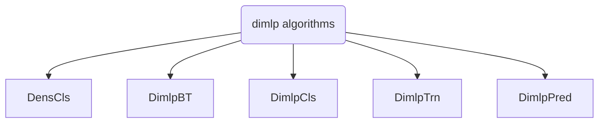

# Dimlp algorithms

!!! warning "Warning"
    **This section is under construction and should not be considered as accurate yet.**

The *Discretized Interpretable Multi-Layer Perceptron* is a particular feed-forward neural network architecture, based on the `MLP` architecture, whose main feature is rule generation.

## Architecture
The architecture is built as shown below:

Each algorithm has its purpose:

- **[Dimlp]()**: Computes like a classic MLP and generates rules.
<!-- - **[DimlpBT]()**: 
- **[DimlpCls]()**:  -->
- **[DimlpTrn]()**: Trains the `Dimlp` model with a given dataset.
- **[DimlpPred]()**: Compute predictions with the `Dimlp` from a given test dataset.
