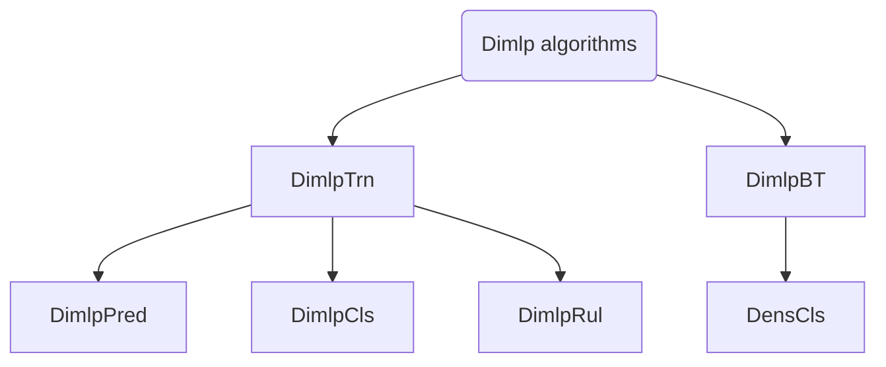

# Dimlp algorithms

!!! warning "Warning"
    **This section is under construction and should not be considered as accurate yet.**

The *Discretized Interpretable Multi-Layer Perceptron (DIMLP)* is a specialized feed-forward neural network architecture, derived from the traditional `MLP` (Multi-Layer Perceptron). `DIMLP` performs predictive tasks and generates interpretable decision rules that explain the underlying reasoning behind the model's predictions. The `DIMLP` framework includes a set of algorithms that leverage this capability for model training, evaluation, and rule extraction.

## Architecture
The architecture is built as shown below:

Each algorithm has its purpose:

- **[DimlpTrn](dimlptrn.md)**: Trains the `Dimlp` model using a training dataset, obtains train/test/validation predictions and model weights, and can optionally extract global rules using the `Dimlp` algorithm.
- **[DimlpPred](dimlppred.md)**: Generates predictions from the trained `Dimlp` model on a test dataset.
- **[DimlpCls](dimlpcls.md)**: Calculates accuracy, generates predictions, and retrieves the values of the first hidden layer from the trained `Dimlp` model on a test dataset.
- **[DimlpRul](dimlprul.md)**: Generates global explanation rules using the `Dimlp` algorithm on the training dataset used to train the `Dimlp` model, and retrieves training, testing, and validation accuracy, if provided.
- **[DimlpBT](dimlpbt.md)**: Trains the `Dimlp` model using a training dataset with bagging, obtains train/test/validation predictions and model weights, and can optionally extract global rules using the `Dimlp` algorithm.
- **[DensCls](denscls.md)**: Generates global explanation rules using the `Dimlp` algorithm and obtains train and test predictions and accuracy from a `Dimlp` model trained with bagging.