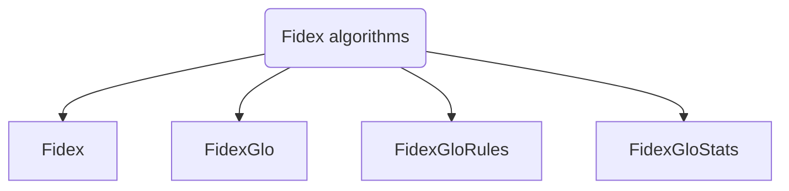

# Fidex algorithms

!!! warning "Warning"
    **This section is under construction and should not be considered as accurate yet.**

The `Fidex` ensemble regroups 4 algorithms. They are all based on the main algorithm with the same name. The `Fidex` algorithm itself aims to extract local rules, explaining the prediction of a pre-trained model for a given data sample. 

## Architecture

The ensemble is built as shown below:

Each algorithm has its purpose:

- **[Fidex]()**: Extracts a rule from a given sample.
- **[FidexGlo]()**: Extracts global rules from a given set of samples. 
- **[FidexGloRules]()**: Extracts global rules from a given set of samples and filters them to remove non-pertinent ones. 
- **[FidexGloStats]()**: Compute statistics from a given global ruleset.