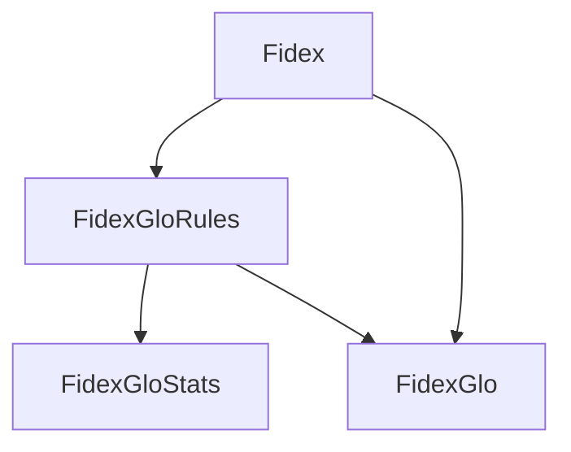

# Fidex algorithms

!!! warning "Warning"
    **This section is under construction and should not be considered as accurate yet.**

The `Fidex` ensemble regroups 4 algorithms. They are all based on the main eponym algorithm. The `Fidex` algorithm itself aims to extract local rules, explaining the prediction of a pre-trained model for a given data sample. 

## Architecture

The ensemble is built as shown below:

Each algorithm has its purpose:

- **[Fidex](fidex.md)**: Extracts an explaining rule for a given sample.
- **[FidexGloRules](fidexglorules.md)**: Extracts global explaining rules from a given set of samples and filters them to remove non-pertinent ones. 
- **[FidexGloStats](fidexglostats.md)**: Compute statistics from a given global ruleset.
- **[FidexGlo](fidexglo.md)**: Extracts an explanation for each given sample by generating one or more explaining rules, using the ruleset created by `FidexGloRules`, or `Fidex` if necessary.