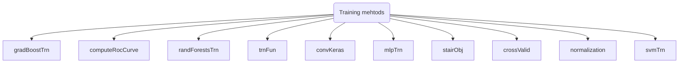

# Training methods

!!!Warning
    **This section is under construction and should not be considered as accurate yet.**

## Architecture

```mermaid
graph TD;
    t(Training mehtods) --> gradBoostTrn;
    t --> computeRocCurve;
    t --> randForestsTrn;
    t --> trnFun;
    t --> convKeras;
    t --> mlpTrn;
    t --> stairObj;
    t --> crossValid;
    t --> normalization;
    t --> svmTrn;
```