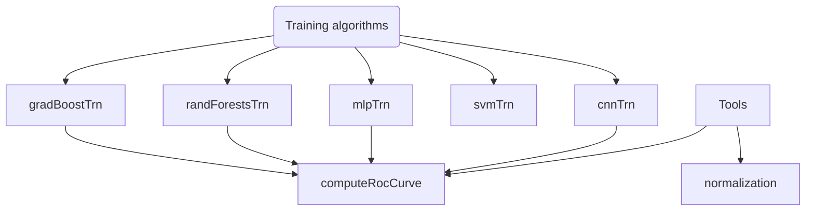

# Training methods

!!! warning "Warning"
    **This section is under construction and should not be considered as accurate yet.**

This collection of algorithms is designed to train various types of models that incorporate a special `Dimlp` layer or extract decision rules. This layer and rules enable the subsequent generation of interpretable decision rules that explain the model's decisions using the `Fidex` algorithm.

## Architecture
The architecture is built as shown below:

Each algorithm has its purpose:

- **[gradBoostTrn](gradboosttrn.md)**: Trains a `Gradient Boosting` decision tree model, generates the decision tree rules for use by `Fidex` in rule extraction, and provides train and test predictions and accuracy.
- **[randForestsTrn](randforeststrn.md)**: Trains a `Random Forest` model, generates the decision tree rules for use by `Fidex` in rule extraction, and provides train and test predictions and accuracy.
- **[mlpTrn](mlptrn.md)**: Trains an `MLP` (Multi-Layer Perceptron) model with a `Dimlp` layer on a training dataset, outputs the weights of this layer for use by `Fidex` in rule extraction, and also provides train and test predictions and accuracy.
- **[svmTrn](svmtrn.md)**: Trains an `SVM` (Support Vector Machine) model with a `Dimlp` layer on a training dataset, outputs the weights of this layer for use by `Fidex` in rule extraction, and provides train and test predictions, accuracy, and the ROC curve computed on the testing dataset.
- **[computeRocCurve](computeroccurve.md)**: Calculates and plots the ROC curve based on a set of test predictions and true classes (not applicable to `SVM` models).
- **[normalization](normalization.md)**: Normalizes data files and denormalizes rules for better interpretation and processing.
- **[cnnTrn](cnntrn.md)**: Trains an `CNN` (Convolutional Neural Network) model with a `Dimlp` layer on a training dataset, outputs the weights of this layer for use by `Fidex` in rule extraction, and also provides train and test predictions and accuracy.