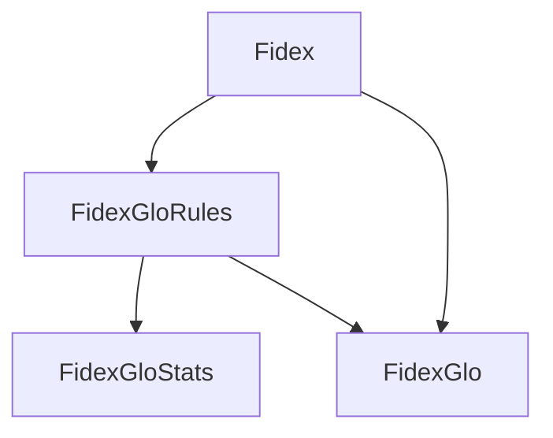

# Fidex algorithms

The `Fidex` ensemble consists of four algorithms, all derived from the core eponymous algorithm. The `Fidex` algorithm itself focuses on extracting local rules to explain the predictions of a pre-trained model for given data samples. Each of the other algorithms builds upon this foundation to offer additional functionalities. For more details on the `Fidex` algorithm, you can refer to [this paper](../../references.md#fidex-an-algorithm-for-the-explainability-of-ensembles-and-svms).

## Architecture

The ensemble is built as shown below:

Each algorithm has its purpose:

- **[Fidex](fidex.md)**: Extracts a local explanation rule for one or more given samples.
- **[FidexGloRules](fidexglorules.md)**: Extracts a set of global explanation rules from a given training dataset.
- **[FidexGloStats](fidexglostats.md)**: Computes statistics from a given global ruleset.
- **[FidexGlo](fidexglo.md)**: Extracts an explanation for each given sample by generating one or more explaining rules, using the ruleset created by `FidexGloRules`, or `Fidex` if necessary.