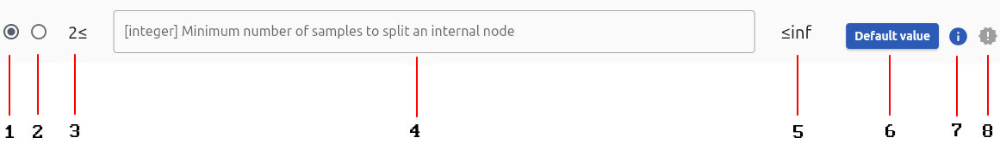
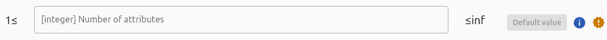
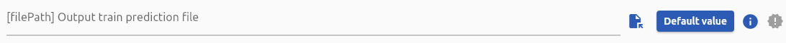

# Graphical User Interface

!!! warning
    **This section is under construction and should not be considered as accurate yet.**

The Dimlpfidex Graphical User Interface was made to help with **`JSON configuration files`**. All the `Fidex` and `Training methods` algorithms can be fed with these files to supply all the data needed to execute them. The problem is, you may not be experienced with `JSON` and `configuration files`. This is the reason why we offer you two outcomes: 

1. Learn by yourself with our [JSON configuration file documentation](file-formats/json-configuration-files.md).
2. Follow the next section to learn how to use the GUI, a tool made to ease your experience with **`JSON configuration files`**.

## Description
[JSON](https://www.json.org/json-en.html) or `JavaScript Object Notation` is a lightweight data interchange format that is easy for humans to read, and easy for machines to parse and generate. It is used to structure data in a way that is both human-readable and machine-friendly, making it an ideal choice for configuration files.

## Installation guide

To install the Dimlpfidex GUI, follow these steps:

!!! tip "Installation guide for..."

    === "Windows"
        1. **Download** the archive by opening your any browser and [downloading the latest release](https://github.com/HES-XPLAIN/dimlpfidex/releases/)
        2. **Decompress** the achive with any file archiver, place the folder where you can find it afterwards (Desktop, Documents, etc...).
        3. **Execute** the program by double-clicking on the `dimlpfidex_gui.exe` file.
        4. Done !

    === "Linux"
        1. **Download** the archive by opening your any browser and [downloading the latest release](https://github.com/HES-XPLAIN/dimlpfidex/releases/)
        2. **Decompress** the achive with any file archiver and place the folder where you can find it afterwards (Desktop, Documents, etc...).
        3. **Execute** the program with the `a.` or `b.` instruction: 
            1. By double-clicking on the `dimlpfidex_gui` file.
            2. By executing the following commands:
            ```sh
            # lets say you placed the folder inside /home/$USER/Documents/
            cd  /home/$USER/Documents/dimlpfidex_gui/
            ./dimlpfidex_gui
            ```
        4. Done !

    === "Web (OS agnostic)"
        1. **Download** the archive by opening your any browser and [downloading the latest release](https://github.com/HES-XPLAIN/dimlpfidex/releases/)
        2. **Decompress** the achive with any file archiver and place the folder where you can find it afterwards (Desktop, Documents, etc...).
        3. **Execute** the web app by installing [node.js](https://www.nodejs.org) if needed and Running the following commands:
            ```sh title="Linux"
            # lets say you placed the folder inside the Documents/ folder 
            cd /home/$USER/Documents/dimlpfidex_gui
            node app.js
            ```
            ```sh title="Windows"
            dir %HOMEPATH%\dimlpfidex_gui
            node app.js
            ```
        4. Open your browser and search for `localhost:8000`
        5. Done !

## Usage guide

To use the GUI, start by opening the app, select the form corresponding to the algorithm you want to use, fill the form and generate it by clicking on the button at the bottom of the form. 

### Features of the GUI

- **User-Friendly Forms**: The GUI provides forms with dropdowns, checkboxes, and text inputs to simplify the creation and editing of JSON files.
- **Validation**: The GUI includes validation checks to ensure that the JSON configuration files are correctly formatted.
- **Large palette**: It can generate a configuration file for every algorithm from `Fidex`, `DIMLP` and `Training methods` ensembles.
- **Embedded documentation**: Has descriptions for every form's component and has a glossary explaining every single field purpose. 

### Field's anatomy

<center></center>
<center><i>Field anatomy</i></center>

1. **Field name**: Indicates the name or label of the field.
2. **File explorer button**: Allows users to browse and select a file (available for path-related fields, **excluding the web version**).
3. **Default button**: Clicking on this button, if colored, automatically adds a default value to the field.
4. **Information icon**: When hovered over with the mouse, provides a description of the field.
5. **Required icon**: If colored, indicates that the field must be filled out and cannot be left empty.

!!!Warning
    The web application cannot use the file browsing feature because of technical limitations.

### Field types
<center></center>
<center><i>Example of numeric field</i></center>

<center></center>
<center><i>Example of file path field</i></center>

- **integer**: Accepts integer values within a specified range.
- **Double precision**: Accepts double precision floating point values.
- **String**: Accepts text strings.
- **Restricted choice string**: Accepts predefined choices from a list.
- **File path**: Allows selection of a file and inputs its absolute path.
- **Boolean**: Accepts true/false values in shape of checkboxes.
- **Directory path**: Allows selection of a directory and inputs its absolute path.
- **Dictionary**: Accepts key-value pairs.
- **List of string**: Accepts a list of text strings.
- **List of integer**: Accepts a list of integer values.
- **List of file path**: Accepts a list of file paths.
- **List of double precision**: Accepts a list of double precision floating point values.


