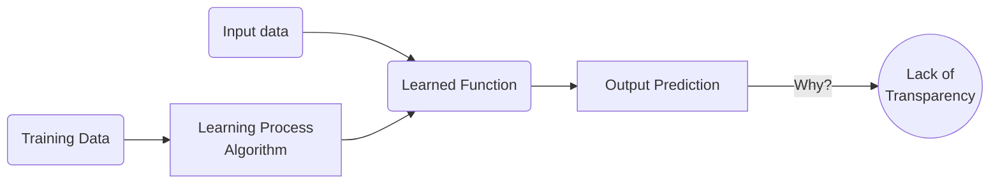
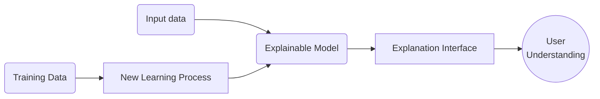

---
hide:
- navigation
- toc
---

{ width="200" align=left }

# XPLAIN

***An open platform for accelerating the development of eXplainable AI systems***

*by [HES-SO](https://www.hes-so.ch/en) - University of Applied Sciences and Arts Western Switzerland*

***

[Why XAI?](#why-xai) | [What we propose](#what-we-propose) | [Who we are](#who-we-are)

***

## :material-chat-question: Why XAI?

!!! failure inline end "Traditional ML model"

    * Why did the model do that?
    * Why not something else?
    * When does the model succeed?
    * When does it fail?
    * When can we trust it?
    * How do we correct an error?

Artificial intelligence (AI) is **rapidly permeating numerous aspects of our lives** and is evolving into a
**game-changer** in many areas, including healthcare, energy, marketing, finance, security,
transportation, robotics, and image/speech recognition. AI growth is fuelled by the rapid increase of
available computational power, the abundance of data for training and testing sophisticated AI
models, and the resurgence of Machine learning (ML) in the last decade.

A **major drawback** with artificial neural networks is that it is **very difficult to explain their responses**
because their knowledge is embedded within the values of the parameters and neuron activations,
which are at first glance incomprehensible. The **transparency of AI models** is an important research
topic, as transparency is essential with respect to the European General Data Protection Regulation
(GDPR). In general, under the GDPR, every individual has the right to receive an explanation when
a decision has been made about them.

> Artificial intelligence (AI) is rapidly growing in various fields due to the availability
of computational power and data for training models. However, the lack of transparency in
AI models, particularly deep neural networks, is a major concern as it raises ethical and legal questions
limiting their societal acceptance.

**Explainable AI (XAI)** aims to address this issue by **explaining how a model produces its
results**.

***

The impressive
effectiveness of AI applications based on DL is often shadowed by their inability to explain their behaviours to human users.
Understanding how these algorithms operate, would allow **demystifying AI**, making such black-boxes
intelligible and explainable, and **improving everyone's confidence** in these tools. Explainable AI
encompasses AI methods aimed at explaining to a given audience, why or how a model produces
its results.

!!! success inline "Explainable AI model"

    * We can understand why
    * We can understand why not
    * We know when it will succeed
    * We know when it will fail
    * We know when to trust it
    * We know when it erred

XAI seeks to address this issue by developing AI models that can provide explanations that are clear, concise, and relevant to the user's context. By providing interpretable explanations for its decisions, XAI can help users better understand the reasoning behind AI models and build trust in their reliability and accuracy.

The **benefits of XAI** are many. For example, it can help to improve the accuracy and performance of
AI models by enabling users to identify and correct errors or biases in the data or the model itself.
XAI can also enhance the accountability and transparency of AI systems, which is essential for ensuring
ethical and fair use of AI in society.

> Explainability is a cornerstone for attaining some of the fundamental principles of **responsible AI**:
*fairness*, *transparency*, *privacy*, *accountability*, *safety*, *security*, and *reliability*.

However, there is currently no general-purpose software technology supporting symbolic
knowledge extraction from predictive models. This **lack of a homogeneous platform for open
science** in which explainability algorithms can be collected and executed is a challenge for
both research and teaching purposes.

***

## :material-target: What we propose

We aim to provide **an open XAI-oriented platform** allowing data scientists to train or
deploy their predictive models and then apply and compare **explainability algorithms** at both low and
high levels of abstraction, allowing to better **explain complex behaviours**.

!!! tip inline end "XPLAIN in summary"

    :material-check: **Broad XAI coverage**

    :material-check: **Lower barrier to adoption**

    :material-check: **Open Source**

    :material-check: **Extensible**

    :material-check: **For the Industry and Education**

!!! info "Who is this project for? You are..."

    === ":material-tie: a Decision maker"
        You are interested in business **benefits, risks and costs**.

        - [x] Get an introduction to explainability
        - [x] Access web demos and use case scenarios

    === ":material-hammer-wrench: an Engineer"
        You want to **try XAI algorithms**.

        - [x] Discover use cases as Jupyter notebooks
        - [x] Get data set, algorithms and Python code

    === ":material-beaker: a Data scientist"
        You want to **use XAI** algorithms in **your pipelines**.

        - [x] Obtain conda and PyPi packages
        - [x] Get extensive API documentation

    === ":material-school: a Professor"
        You want a tool for **teaching** explainable AI.

        - [x] Deploy the platform on school IT infrastructure or public cloud
        - [x] Adapt provided use cases to teaching needs

Explaining complex models involves dealing with different levels of abstraction.

* **Low-level explanations** capture fundamental relationships between input features.
* **High-level explanations** uncover higherabstraction patterns and relationships and present them
in an intelligible form.

The proposed platform comes with explainability to connectionist models, including neural
networks and their ensembles, as well as DL architectures.

It will include a **selection of well-known and widely-used XAI approaches** from the literature,
as well as **XAI algorithms coming from our own research**.

***

## :fontawesome-solid-people-group: Who we are

The **HES-SO** is a **Swiss university of applied sciences** that offers various academic programs,
research projects, and services in the fields of technology, design, economy, and social work.
It has a strong focus on practical and applied knowledge, and its mission is to **contribute to
the economic and social development** of Switzerland through its **research and innovation** activities.

Regarding the advancement of machine learning, the HES-SO is a leading institution in Switzerland
that provides high-quality education, research, and development in this field. It has a team of
experienced and knowledgeable professors, researchers, and practitioners who work on cutting-edge
projects and initiatives in collaboration with industry partners and other academic institutions.

The HES-SO also has a **strong network** of alumni and professional contacts **in the industry**, which ensures
that its graduates are well-prepared and have excellent job prospects in the machine learning field.

Overall, the HES-SO is a dynamic and innovative institution that **contributes to the development of
machine learning** in Switzerland and beyond.
