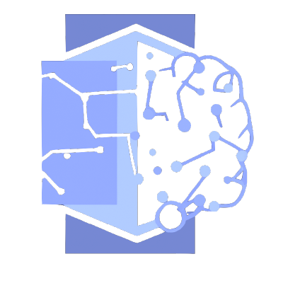

---
hide:
- navigation
- toc
---

{ width="200" align=left }

# XPLAIN

***An open platform for accelerating the development of eXplainable AI systems***

*by [HES-SO](./team) - University of Applied Sciences and Arts Western Switzerland*

***

We aim to provide **an open XAI-oriented platform** allowing data scientists to train or
deploy their predictive models and then apply and compare **explainability algorithms** at both low and
high levels of abstraction, allowing to better **explain complex behaviours**.

!!! tip inline end "XPLAIN in summary"

    :material-check: **Broad XAI coverage**

    :material-check: **Lower barrier to adoption**

    :material-check: **Open Source**

    :material-check: **Extensible**

    :material-check: **For the Industry and Education**

!!! info "Who is this project for? You are..."

    === ":material-tie: a Decision maker"
        You are interested in business **benefits, risks and costs**.

        - [x] Get an [introduction](./introduction) to explainability
        - [x] Access web demos and use case scenarios

    === ":material-hammer-wrench: an Engineer"
        You want to **try XAI algorithms**.

        - [x] Discover use cases as Jupyter notebooks
        - [x] Get data set, algorithms and Python code

    === ":material-beaker: a Data scientist"
        You want to **use XAI** algorithms in **your pipelines**.

        - [x] Obtain conda and PyPi packages
        - [x] Get extensive API documentation

    === ":material-school: a Professor"
        You want a tool for **teaching** explainable AI.

        - [x] Deploy the platform on school IT infrastructure or public cloud
        - [x] Adapt provided use cases to teaching needs

Explaining complex models involves dealing with different levels of abstraction.

* **Low-level explanations** capture fundamental relationships between input features.
* **High-level explanations** uncover higherabstraction patterns and relationships and present them
in an intelligible form.

The proposed platform comes with explainability to connectionist models, including neural
networks and their ensembles, as well as DL architectures.

It will include a **selection of well-known and widely-used XAI approaches** from the literature,
as well as **XAI algorithms coming from our own research**.

***

