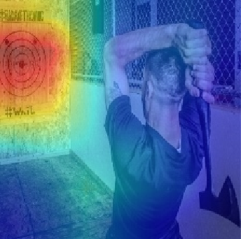

# :material-notebook: Use cases notebooks

Welcome to the interactive notebooks section, dedicated to showcase Explainable Artificial Intelligence (XAI) techniques in various use cases.

These notebooks aim to make XAI more approachable by providing practical examples and explanations.
We have curated a diverse range of notebooks for audiences with varying levels of expertise.

Explore our collection of notebooks to understand how AI models make decisions, interpret their outputs, and gain insights into their predictions.

## Interactive sessions

Whether you prefer the convenience of launching an online interactive session or the flexibility of a local session,
we provide you with the necessary tools. Simply choose between launching an **online session** in **Google Colab**
or setting up a **local session** with our provided **Docker Compose files**.

**Note:** A **Google account** is required to access Google Colab free of charge.

??? tip ":simple-googlecolab: Online session: How to launch Google Colab"

    * Click on the provided link to open the notebook in your browser.
    * In the upper right corner of the editor, click on the downward arrow right of the **Connect** and then **Change runtime type**.
    * Select **T4 GPU** to make use of GPU accelleration, then **Save**.
    * Click on **Connect**.

When you are done, the environment will be shutdown after 30 minutes of inactivity. You can also shut it down
manually by clicking on **Runtime** menu then by selecting **Disconnect and delete runtime**.

??? tip ":octicons-desktop-download-24: Local session: How to install Docker Desktop"

    The provided Docker Compose files allow you to easily launch Jupyter notebooks and embedded data locally, giving you
    convenient access to the notebook content and data.

    You only need to install [Docker Desktop](https://www.docker.com/) and then download the Docker Compose file.

    * Go to the [Docker website](https://www.docker.com/)
    * Download the appropriate Docker Desktop version for your operating system (:simple-windows11: :simple-apple: :simple-linux:).
    * Open a terminal or command prompt and run `docker version` to verify the installation.
    * Ensure Docker Desktop is running.
    * Download the Docker Compose files on this page and launch them with `docker compose up -f path/to/docker-compose.yml`.

## Class Activation Maps (CAM)

Through this use case, we aim to empower users to grasp the potential of CAM as a tool for transparent and interpretable sport image classification.

!!! example "Sport Image Classification with Class Activation Maps (CAM)"

    { width="200px", align=left }

    **Class Activation Maps (CAM)**

    * :simple-googlecolab: **Online**: 
    * :octicons-desktop-download-24: **Local**: <a href="https://raw.githubusercontent.com/HES-XPLAIN/notebooks/main/docker-compose.yml" target="_blank">Docker Compose file</a> **(Right click, "Save link as")**

    **Important**: To run the notebook on Google Colab successfully, ensure to change the variable `use_colab` in the first cell to **True**.

    In this use case, we dive into sport image classification and showcase the power of **Class Activation Maps** (CAM) as an
    interpretability tool.

    CAM allows us to visualize the regions of an image that contribute most to the model's classification decision.
    By overlaying **heatmaps** onto the original images, we gain insights into the model's attention and its understanding of different sports.

While focusing on a specific image classification task using a pre-trained model, our goal is to demonstrate how XAI empowers users to explore and interpret image classifiers effectively.

By the end of this use case, you will have a solid understanding of CAM and how to integrate it into your own projects.

## Rules Extraction

Through this use case, we aim to empower users to grasp the potential of Rules Extraction as a tool for transparent and interpretable sport image classification.

!!! example "Sport Image Classification with Rules Extarction"

    { width="200px", align=left }

    **Rules Extraction**

    **Important**: To run the notebook on Google Colab successfully, ensure to change the variable `use_colab` in the first cell to **True**.

    * :simple-googlecolab: **Online**: 
    * :octicons-desktop-download-24: **Local**: <a href="https://raw.githubusercontent.com/HES-XPLAIN/notebooks/main/docker-compose.yml" target="_blank">Docker Compose file</a> **(Right click, "Save link as")**

    In this use case, we dive into sport image classification and showcase the power of **Rules Extraction** as an interpretability tool.

While focusing on a specific image classification task using a pre-trained model, our goal is to demonstrate how XAI empowers users to explore and interpret image classifiers effectively.

By the end of this use case, you will have a solid understanding of Rules Extraction and how to integrate it into your own projects.

## Activation-Maximization

WIP

