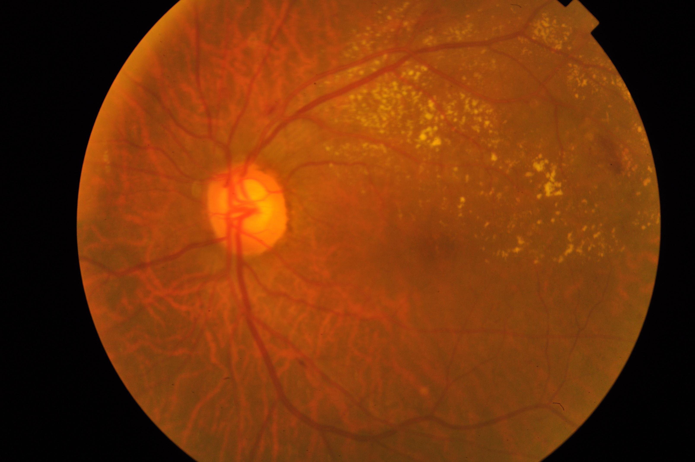
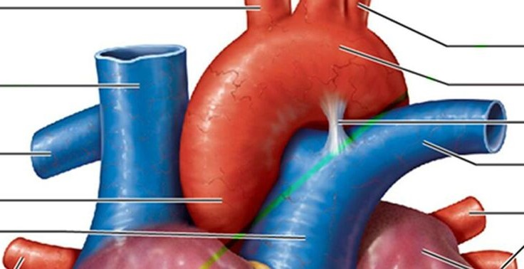
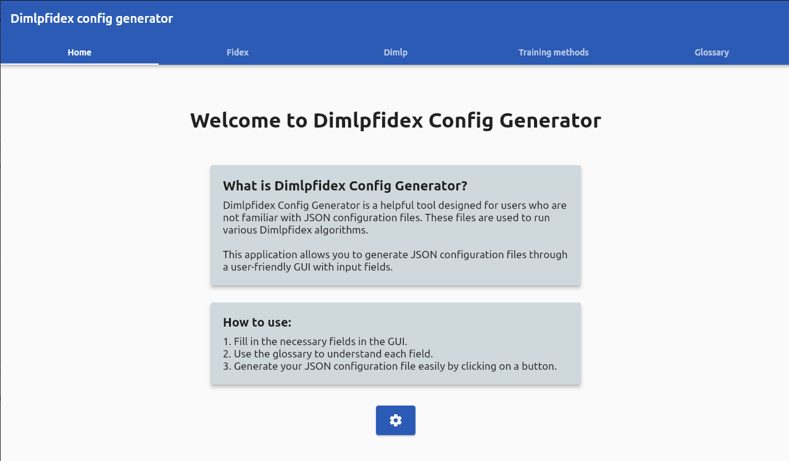

# :material-notebook: Use cases notebooks

Welcome to the interactive notebooks section, dedicated to showcase Explainable Artificial Intelligence (XAI) techniques in various use cases.

These notebooks aim to make XAI more approachable by providing practical examples and explanations.
We have curated a diverse range of notebooks for audiences with varying levels of expertise.

Explore our collection of notebooks to understand how AI models make decisions, interpret their outputs, and gain insights into their predictions.

---

There are 2 categories of notebooks:

* :material-hammer-wrench: **Tutorials**: Explore various notebooks illustrating practical uses of XAI techniques in different machine learning scenarios.
* :material-test-tube: **Use cases**: Focus on a particular goal-oriented ML task with notebooks demonstrating the integration of XAI techniques for greater interpretability.

To launch the notebooks, refer to [Using notebooks](usage.md#notebooks-datasets).

!!! warning

    **Important**: To run the notebook on Google Colab successfully, ensure to change the variable `use_colab` in the first cell to **True**.

## Tutorials

### Class Activation Maps (CAM)

Through this use case, we present the potential of CAM as a tool for transparent and interpretable sport image classification.

!!! example "Sport Image Classification with Class Activation Maps (CAM)"

    { width="200px", align=left }

    **Class Activation Maps (CAM)**

    * :simple-googlecolab: **Online**: 
    * :octicons-desktop-download-24: **Local**: <a href="https://raw.githubusercontent.com/HES-XPLAIN/notebooks/main/docker-compose.yml" target="_blank">Docker Compose file</a> **(Right click, "Save link as")**

In this use case, we dive into sport image classification and showcase the power of **Class Activation Maps** (CAM) as an
interpretability tool.

CAM allows us to visualize the regions of an image that contribute most to the model's classification decision.
By overlaying **heatmaps** onto the original images, we gain insights into the model's attention and its understanding of different sports.

While focusing on a specific image classification task using a pre-trained model, our goal is to demonstrate how XAI empowers users to explore and interpret image classifiers effectively.

By the end of this use case, you will have a solid understanding of CAM and how to integrate it into your own projects.

### Rules Extraction
Through this use case, we aim to present the potential of [Rules Extraction package](documentation/rulesextraction/overview.md) as a tool for transparent and interpretable sport image classification.

!!! example "Sport Image Classification with Rules Extarction"

    { width="200px", align=left }

    **Rules Extraction**

    * :simple-googlecolab: **Online**: 
    * :octicons-desktop-download-24: **Local**: <a href="https://raw.githubusercontent.com/HES-XPLAIN/notebooks/main/docker-compose.yml" target="_blank">Docker Compose file</a> **(Right click, "Save link as")**

In this use case, we dive into the same specific sport image classification task using a pre-trained model. We demonstrate the power of **Rules Extraction** as an interpretability tool, allowing to explore and interpret image classifiers effectively.

By the end of this notebook, you will have a solid understanding of Rules Extraction and how to integrate it into your own projects.

### Feature Visualisation

Through this use case, we aim to present the potential of Feature Visualisation as a tool for transparent and interpretable sport image classification.

!!! example "Sport Image Classification with Feature Visualisation"

    { width="200px", align=left }

    **Feature Visualisation**

    * :simple-googlecolab: **Online**: 
    * :octicons-desktop-download-24: **Local**: <a href="https://raw.githubusercontent.com/HES-XPLAIN/notebooks/main/docker-compose.yml" target="_blank">Docker Compose file</a> **(Right click, "Save link as")**

In this use case, we dive into  the same specific sport image classification task using a pre-trained model. We demonstrate the power of **Feature Visualisation** as an interpretability tool, allowing to explore and interpret image classifiers effectively.

By the end of this notebook, you will have a solid understanding of Feature Visualisation and how to integrate it into your own projects.

---

## Use Cases

### APTOS 2019 Blindness Detection

Through this use case, we aim to to show how to use XAI techniques and methods to create an explainable model to classify images from the APTOS 2019 Blindness Detection dataset. We also builds post-hoc local and global explanations to explain the model and its prediction. 

We used the [MLxplain package](documentation/mlxplain/overview) that we developed to put together our explainability methods and the omniXAI explainers.

!!! example "APTOS 2019 Blindness Detection"

    { width="200px", align=left }

    **APTOS 2019 Blindness Detection**

    * :simple-googlecolab: **Online**: 
    * :octicons-desktop-download-24: **Local**: <a href="https://raw.githubusercontent.com/HES-XPLAIN/notebooks/main/docker-compose.yml" target="_blank">Docker Compose file</a> **(Right click, "Save link as")**

### Sport Image Classification

Through this use case, we aim to to show how to use XAI techniques and methods to create an explainable model to classify images from the Sports Image Classification dataset. We also builds post-hoc explanations to explain the model and its prediction.

!!! example "Sport Image Classification"

    { width="200px", align=left }

    **Sports Image Classification**

    * :simple-googlecolab: **Online**: 
    * :octicons-desktop-download-24: **Local**: <a href="https://raw.githubusercontent.com/HES-XPLAIN/notebooks/main/docker-compose.yml" target="_blank">Docker Compose file</a> **(Right click, "Save link as")**

### MNIST

Through this use case, we aim to to show how to use XAI techniques and methods to create an explainable model to classify images from the MNIST dataset. We also builds post-hoc explanations to explain the model and its prediction.

!!! example "MNIST Image Classification"

    { width="200px", align=left }

    **MNIST Image Classification**

    * :simple-googlecolab: **Online**: 
    * :octicons-desktop-download-24: **Local**: <a href="https://raw.githubusercontent.com/HES-XPLAIN/notebooks/main/docker-compose.yml" target="_blank">Docker Compose file</a> **(Right click, "Save link as")**

### Cracks

Through this use case, we aim to show how to use XAI techniques and methods to create an explainable model to classify images from cracked concrete image dataset. We also builds post-hoc explanations to explain the model and its prediction.

!!! example "Cracks Image Classification"

    { width="200px", align=left }

    **Cracks Image Classification**

    * :simple-googlecolab: **Online**: 
    * :octicons-desktop-download-24: **Local**: <a href="https://raw.githubusercontent.com/HES-XPLAIN/notebooks/main/docker-compose.yml" target="_blank">Docker Compose file</a> **(Right click, "Save link as")**

### Breast cancer classification

Through this use case, we demonstrate how to use Dimlp to train a model based on breast cancer tumors dataset and the Fidex algorithms to extract rules.

!!! example "Breast cancer classification"

    { width="200px", align=left }

    **Breast cancer classification**

    * :simple-googlecolab: **Online**: 
    * :octicons-desktop-download-24: **Local**: <a href="https://raw.githubusercontent.com/HES-XPLAIN/notebooks/main/docker-compose.yml" target="_blank">Docker Compose file</a> **(Right click, "Save link as")**

### Obesity Cardiovascular risk classification

As an alternative to the previous notebook, this use case aims to use a different dataset and training model to show the versatility of our explainability tools. In addition, we will cover how to pre-process a dataset that is not initially usable by a model and convert it to an exploitable dataset.

!!! example "Obesity Cardiovascular Risk Classification"

    { width="200px", align=left }

    **Obesity Cardiovascular Risk Classification**

    * :simple-googlecolab: **Online**: 
    * :octicons-desktop-download-24: **Local**: <a href="https://raw.githubusercontent.com/HES-XPLAIN/notebooks/main/docker-compose.yml" target="_blank">Docker Compose file</a> **(Right click, "Save link as")**

### Use dimlpfidex within the OmniXAI library

Through this use case, learn to use dimlpfidex with OmniXAI by exploring the heart attack prediction dataset and extracting explanatory rules. We will also generate local and global explanation graphs in a dashboard using this library.

!!! example "Heart attack prediction with OmniXAI"

    { width="200px", align=left }

    **Heart Attack Risk Prediction**

    * :simple-googlecolab: **Online**: 
    * :octicons-desktop-download-24: **Local**: <a href="https://raw.githubusercontent.com/HES-XPLAIN/notebooks/main/docker-compose.yml" target="_blank">Docker Compose file</a> **(Right click, "Save link as")**

### Generate dimlpfidex JSON configuration files with the GUI

!!! info
    You should [install the GUI](documentation/dimlpfidex/gui.md#installation-guide) before following this notebook.

If you are not used to deal with JSON configuration files and would like to get over it as fast as possible, a GUI is available to help you. Through this short notebook, you will learn how to generate a configuration file using this app and input it in one of the Fidex algorithms.

!!! example "Dimlpfidex GUI"
    { width="200px", align=left }

    **Dimlpfidex GUI**

    * :simple-googlecolab: **Online**: 
    * :octicons-desktop-download-24: **Local**: <a href="https://raw.githubusercontent.com/HES-XPLAIN/notebooks/main/docker-compose.yml" target="_blank">Docker Compose file</a> **(Right click, "Save link as")**
