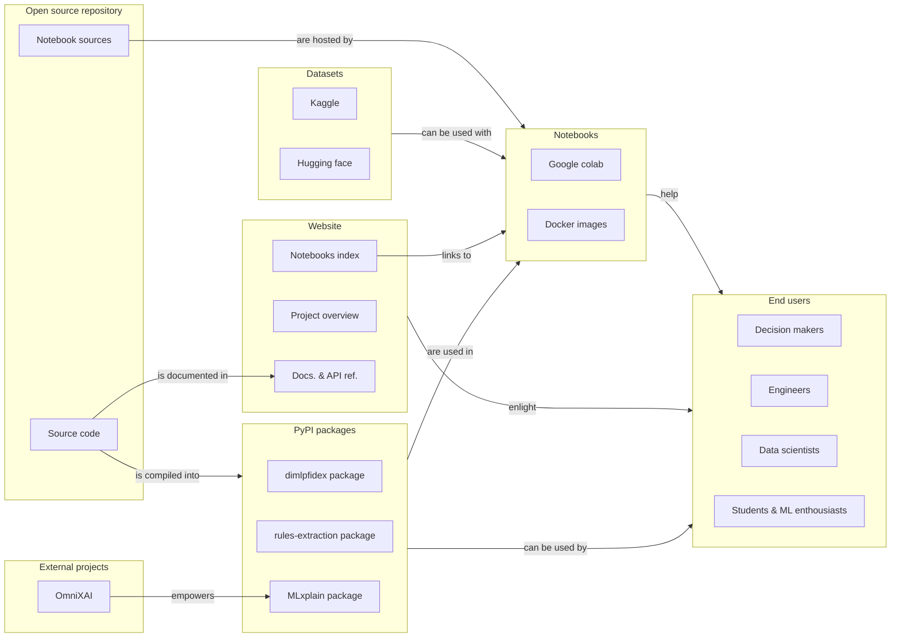

Our platform is divided in several sections, which interacts with each other to deliver XAI solutions to the end user.

## Open source repository
Where core algorithms and features are developed.

HES-XPLAIN assembles our own developed algorithms as well as incorporating all algorithms proposed by [OmniXAI](https://github.com/salesforce/omnixai). Our platform provides a comprehensive suite of tools for XAI, enabling users to compare and choose the best techniques for their needs. Explore our algorithms in the [HES-XPLAIN - Algorithms](algos.md) section.

## PyPI package
Python wrappers meant to ease the installation and use of our tools:

## Notebooks & Datasets
Practical ressources & content aiming to help understanding how to use the different features provided, all accessible from our website including:

- **XAI Resource**: Literature and resources that describe what/why/how Explainable Artificial Intelligence.
- **Tutorial Notebooks**: Step-by-step guides to help users understand and apply XAI methods.
- **Use Case Notebooks**: Showcase how XAI and our platform can be used to solve real-world problems.
- **Datasets and Models**: Embedded datasets and pre-trained models to facilitate experimentation.

These are provided with solutions that facilitate deployment, including:

- **Notebook Server Package**: A pre-configured environment to run Jupyter notebooks.
- **Docker Image**: Containerized versions of our platform components for easy deployment on local machines or cloud environments.

More details can be found in the [notebooks](../notebooks.md) section.