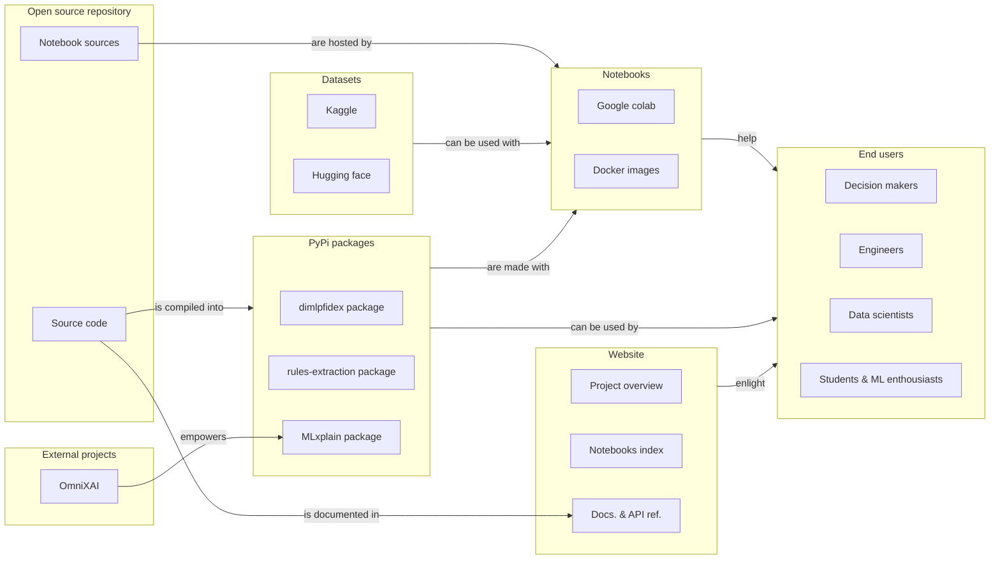

## Components of HES-XPLAIN

### Source Code Repository

Our source code repository hosts all the necessary assets, including:

- **Source Code**: The core algorithms and functionalities developed for XAI.
- **Notebooks**: Interactive Jupyter notebooks that demonstrate how to use our XAI algorithms.
- **Docs**: Comprehensive documentation that guides users on how to utilize the platform effectively.

### Algorithms

HES-XPLAIN assembles our own developed algorithms as well as incorporating all algorithms proposed by [OmniXAI](https://github.com/salesforce/omnixai). Our platform provides a comprehensive suite of tools for XAI, enabling users to compare and choose the best techniques for their needs. Explore our algorithms in the [HES-XPLAIN - Algorithms](algos.md) section.

Our algorithms are individually packaged and accessible through the Python Package Index (PyPi), making it easy for users to install and use them in their own projects.

### Deployment Options

HES-XPLAIN provides flexible deployment options to suit different user needs:

- **Google Colab**: Online deployment through Google Colab for easy access and experimentation with our algorithms, tutorials, and use cases.
- **Container**: Local deployment using Docker files to easily try our solutions locally.
- **Private Deployment Platform**: Private deployement to ensure privacy within the HES-XPAIN platform

The container registry contains assets that facilitate deployment, including:

- **Notebook Server Package**: A pre-configured environment to run Jupyter notebooks.
- **Docker Image**: Containerized versions of our platform components for easy deployment on local machines or cloud environments.

For advanced users and enterprises, we offer a private deployment platform that supports:

- **Private Datasets**: Securely manage and use private datasets within the HES-XPLAIN platform.
- **Deployment Flexibility**: Deploy our solutions within private infrastructures using Kubernetes or other orchestration tools.

### Ressource and Tutorials 

We offer multiple resources to enhance XAI knowledge, all accessible from our website including:

- **XAI Resource**: Literature and resources that describe what/why/how Explainable Artificial Intelligence.
- **Tutorial Notebooks**: Step-by-step guides to help users understand and apply XAI methods.
- **Use Case Notebooks**: Showcase how XAI and our platform can be used to solve real-world problems.
- **Datasets and Models**: Embedded datasets and pre-trained models to facilitate experimentation.

More details can be found in the [HES-XPLAIN - Resources](ressources.md) section.
