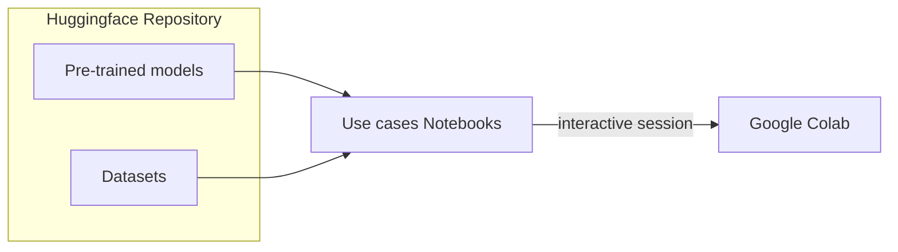
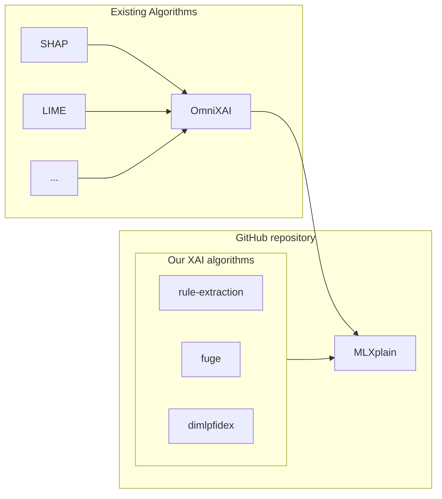
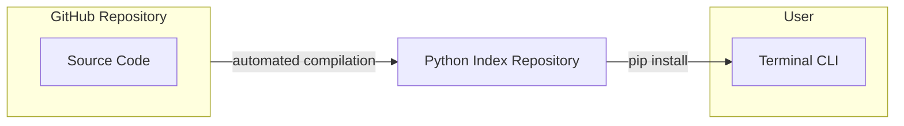
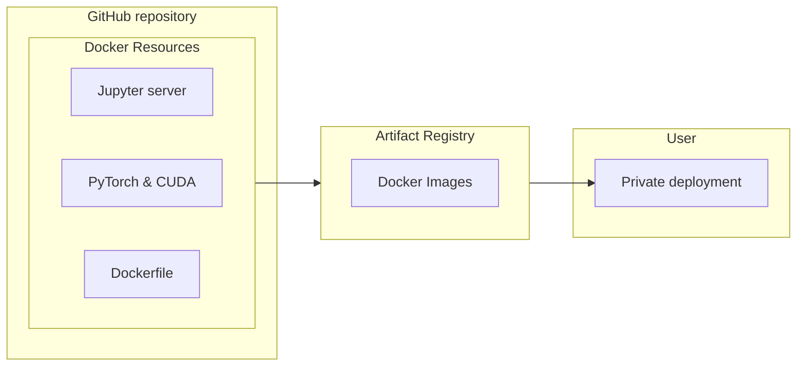

Despite advancements in the field of eXplainable Artificial Intelligence (XAI), many existing XAI tools remain complex and challenging to use.

The XPLAIN platform aims to address this challenge by making XAI more accessible, by providing an intuitive, ready-to-use environment that consolidates various XAI techniques helping users to better understand and apply AI insights effectively.

## Notebooks & Datasets

We offer a range of tutorials and how-to guides presented as **use cases** in **interactive notebooks**. Users can explore and experiment with these resources to explore various XAI methods available. Additionally, **datasets** and **trained models** are accessible in our HuggingFace repository, and the notebooks can be opened and tested directly on Google Colab.

On our website, you will thus find:

- **Tutorial Notebooks**: Step-by-step guides to help users understand and apply XAI methods.
- **Use Case Notebooks**: Demonstrations of how XAI and our platform can address real-world problems.
- **Datasets and Models**: Embedded datasets and pre-trained models to facilitate experimentation.
- **Other XAI Resourcse**: Literature and resources that explain how Explainable Artificial Intelligence works.

These practical resources aim to help users understand and utilize the various features available on our platform.

Online deployment through Google Colab allows for easy access and experimentation with our algorithms, tutorials, and use cases, without the need to install Python and XAI libraries on a local machine.

The interactive notebooks can be found in the [Notebooks](../notebooks.md) section.

??? tip ":octicons-desktop-download-24: Using notebooks"

    **How to use interactive sessions with notebooks**

    You can launch notebooks conveniently in an online interactive session.
    Simply choose launching an **online session** in **Google Colab**.

    **Note:** A **Google account** is required to access Google Colab free of charge.

    ??? tip ":simple-googlecolab: Online session: How to launch Google Colab"

        * Click on the provided link to open the notebook in your browser.
        * In the upper right corner of the editor, click on the downward arrow right of the **Connect** and then **Change runtime type**.
        * Select **T4 GPU** to make use of GPU accelleration, then **Save**.
        * Click on **Connect**.

    When you are done, the environment will be shutdown after 30 minutes of inactivity. You can also shut it down
    manually by clicking on **Runtime** menu then by selecting **Disconnect and delete runtime**.

## Algorithms code

In [algos](algos.md) we introduce our XAI algorithms. They are developed in an open source manner in GitHub repositories.
They consist of **Python** and **C++** code using the **pybind11** binding library.

The platform assembles our own developed algorithms as well as incorporating all algorithms proposed by [OmniXAI](https://github.com/salesforce/omnixai) through the overaching **MLXplain** package. This comprehensive suite of tools for XAI enables users to compare and choose the best techniques for their needs.

Explore our algorithms in the [Algorithms](algos.md) section.

## Python packages

Our algorithms are packaged in the latest standards-compliant formats and stored on our platform under an open, permissive, and business friendly licence.

??? tip "Obtaining the Python packages"
    The algorithms and overaching python packages is available on the [Python Package Index](https://pypi.org/):

    * :material-language-python: [rules-extraction](https://pypi.org/project/rules-extraction/)
    * :material-language-python: [dimlpfidex](https://pypi.org/project/dimlpfidex/)
    * :material-language-python: [mlxplain](https://pypi.org/project/mlxplain/)

The packaging process is entirely automated from the source repositories. This simplifies code maintenance and release processes on the public Python Index, allowing data scientists to obtain these algorithms quickly from their command line to  integrate them into their workflow without friction.

To obtain the Python package, follow the [Installation guide](../documentation/installation-guide.md).

## Containerized images

Additionally to the use cases available as online interactive session, the platform offers ready-to-use deployment solutions in the form of downloadable Docker images available in the public GitHub artifact registry. This streamlined deployment of notebooks and datasets includes all the necessary libraries, allowing users to concentrate on explainability issues.

The following solutions are provided to facilitate deployment:

- **Notebook Server Package**: A pre-configured environment for running Jupyter notebooks.
- **Python XAI Libraries**: All essential XAI libraries, including our custom algorithms and OmniXAI.
- **CUDA Support**: Hardware-accelerated support for notebooks for users with NVIDIA graphics cards.

??? tip ":octicons-desktop-download-24: Using Docker images in a local session"

    **How to use notebooks locally**

    If you prefer the flexibility of a local session, we provid you with the necessary tools to launch notebooks conveniently on your machine. Simply set up a local session with our provided **Docker Compose** files.

    ??? tip ":octicons-desktop-download-24: Local session: How to install Docker Desktop"

        The provided Docker Compose files allow you to easily launch Jupyter notebooks and embedded data locally, giving you
        convenient access to the notebook content and data.

        You only need to install [Docker Desktop](https://www.docker.com/) and then download the Docker Compose file.

        * Go to the [Docker website](https://www.docker.com/)
        * Download the appropriate Docker Desktop version for your operating system (:simple-windows11: :simple-apple: :simple-linux:).
        * Open a terminal or command prompt and run `docker version` to verify the installation.
        * Ensure Docker Desktop is running.
        * Download the Docker Compose files on this page and launch them with `docker compose up -f path/to/docker-compose.yml`.

These containerized versions of our platform components allow for easy deployment on local machines or within private cloud environments. This is especially useful for advanced users and enterprises, where a private deployment of the platform allows some key advantages:

- **Private Datasets**: Securely manage and use private datasets within the HES-XPLAIN platform.
- **Deployment Flexibility**: Deploy our solutions within private infrastructures using Kubernetes or other orchestration tools.

## Platform expansion

The platform is designed to be a flexible and collaborative tool,  allowing anyone to add new algorithms to improve its explanatory capabilities. It also supports the creation of new notebooks for improved usability.

We have already used and extended the existing OmniXAI framework, leveraging its extensive documentation to incorporate new algorithms and ensure their seamless integration.

We strongly encourage contributions not only to the platform itself but also to the development of our algorithms. We aim to continuously improve the platform and expand its functionality in a collaborative manner, making it a valuable resource for the community.
