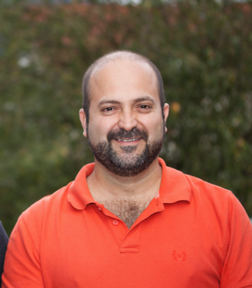
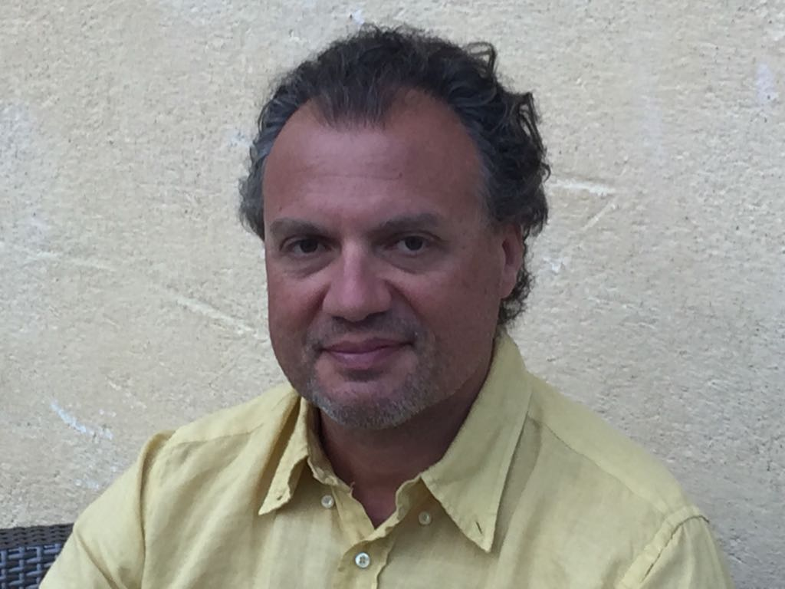

# :fontawesome-solid-people-group: Who we are

## The HES-SO

The **[HES-SO](https://www.hes-so.ch/en)** is a **Swiss university of applied sciences** that offers various academic programs,
research projects, and services in the fields of technology, design, economy, and social work.
It has a strong focus on practical and applied knowledge, and its mission is to **contribute to
the economic and social development** of Switzerland through its **research and innovation** activities.

Regarding the advancement of machine learning, the HES-SO is a leading institution in Switzerland
that provides high-quality education, research, and development in this field. It has a team of
experienced and knowledgeable professors, researchers, and practitioners who work on cutting-edge
projects and initiatives in collaboration with industry partners and other academic institutions.

The HES-SO also has a **strong network** of alumni and professional contacts **in the industry**, which ensures
that its graduates are well-prepared and have excellent job prospects in the machine learning field.

Overall, the HES-SO is a dynamic and innovative institution that **contributes to the development of
machine learning** in Switzerland and beyond.

## Team members

### [Prof. Carlos Peña](https://people.hes-so.ch/en/profile/269853581-carlos-andres-pena)

PhD, HEIG-VD, Director of the Institute of Information and Communication Technologies (IICT)

{ width="200px", align=left }

Professor Peña has extensive expertise in Explainable 
Artificial Intelligence (XAI). Across several CTI and SNSF projects (DiagnoSuite, BossExplorer, 
nanoFUGE, ISyPeM) he has developed and successfully applied his interpretable modelling 
approach, dubbed *Fuzzy CoCo* and based on evolutionary algorithms and fuzzy logic, to several
diagnostic and biomarker-discovery tasks. Based on this algorithm he has published open-source 
packages (*Trefle*[^1], *fugeR*[^2]) and produced an unpublished package that led to the creation of
SimplicityBio, a company today integrated into Precision QuartzBio and that also led to the obtention
of a patent (WO/2017/199067).

From 2016 to 2018, with the project *"D-Rex: Rule extraction from
deep neural networks"*, (Hasler foundation grant)[^3], [^4], his group focused on the investigation of
knowledge extraction methods from deep neural networks (CNNs). The methods developed in this 
project were able to extract simple rules based on high-level features[^4], extract class-relevant
input features and highlight them in specific inputs [^4], and recreate prototypical images for specific
classes or internal features allowing users to gain insights into the inner representations of the 
trained network[^4].

Since 2020, the team participates to the SNSF NRP77 project *"EXPLaiN:
Ethical and Legal issues of Mobile Health Data – Improving understanding and eXPlainability of 
digitaL transformAtion and data technologies using artificial IntelligeNce"*, which focus on the
implementation and test of explainable models in the context of mobile health data.

[^1]: https://pypi.org/project/trefle/
[^2]: https://cran.r-project.org/web/packages/fugeR/
[^3]:
    Gomez Schnyder, Stéphane, Despraz, Jérémie, et Peña-Reyes, Carlos Andrés, « Improving neural
    network interpretability via rule extraction », Greece, p. 811‑813, octobre 2018.
[^4]:
    J. Despraz, S. Gomez, H. F. Satizábal, et C. A. Peña-Reyes, « Exploring Internal Representations of
    Deep Neural Networks », in Computational Intelligence, vol. 829, C. Sabourin, J. J. Merelo, K. Madani,
    et K.Warwick, Éd. Cham: Springer International Publishing, 2019, p. 119‑138. doi: 10.1007/978-3-030-16469-0_7.

### [Prof. Marcel Graf](https://people.hes-so.ch/en/profile/2002425133-marcel-graf)

PhD, HEIG-VD

{ width="200px", align=left }

Professor Graf has more than 20 years of experience in 
software engineering, including 16 years at IBM Research. He has developed digital platforms that 
give structure to technical expertise and make it available to a broader non-technical audience[^5].
In an Innosuisse project with *Avalia Systems* he has developed a platform that allows experts in
software engineering to organise and streamline their work in software assessments and 
communicate their insights to business clients. The platform can be flexibly deployed on Avalia's or 
the client's IT. In another Innosuisse project with *Flybotix* he is developing a cloud-based platform
for drone inspection flights. The platform uses short-lived massive cloud resources for 
photogrammetric processing with low latency and enables remote inspection experts to follow and 
supervise a drone flight remotely.

[^5]:
    T. Grandison et al., « Elevating the Discussion on Security Management: The Data Centric
    Paradigm », in 2007 2nd IEEE/IFIP International Workshop on Business-Driven IT Management, Munich,
    Germany, mai 2007, p. 84‑93. doi: 10.1109/BDIM.2007.375015.

### [Prof. Guido Bologna](https://people.hes-so.ch/en/profile/33748034-guido-bologna)

PhD, HEPIA-GE

{ width="200px", align=left }

Professor Bologna introduced a neural network model 
from which propositional rules are generated [^6]. These rules are natural with respect to the logic
of human reasoning. A clear advantage of the introduced model, which is called *Discretized
Interpretable Multi Layer Perceptron (DIMLP)* is that for a given input, we can refer the activated
rules and determine range inputs relevant to the decision. Later, the DIMLP transparency framework 
was applied to ensembles [^7]. A rule extraction technique that is essential to the explicability of deep
Multi-Layer Perceptrons (MLPs) was presented in [^8]. Subsequently, a comprehensive comparison
of rule extraction techniques was proposed for 25 classification problems [^9]. The compared models
were ensembles of DIMLPs, ensembles of decision trees and Support Vector Machines (SVMs). 
Finally, in [^10] the rule extraction problem was tackled from a simple convolutional architecture with
respect to textual data and melanoma images [^11]. Many of about 100 papers he has authored or
co-authored are available on ResearchGate [^12].

[^6]:
    Bologna, Guido et Pellegrini, Christian, « Three medical examples in neural network rule extraction »,
    183‑187, 1997.
[^7]:
    G. Bologna, « Is it worth generating rules from neural network ensembles? », Journal of Applied
    Logic, vol. 2, no 3, p. 325‑348, sept. 2004, doi: 10.1016/j.jal.2004.03.004.
[^8]:
    G. Bologna et Y. Hayashi, « Characterization of Symbolic Rules Embedded in Deep DIMLP
    Networks: A Challenge to Transparency of Deep Learning », Journal of Artificial Intelligence and Soft
    Computing Research, vol. 7, no 4, p. 265‑286, oct. 2017, doi: 10.1515/jaiscr-2017-0019.
[^9]:
    G. Bologna et Y. Hayashi, « A Comparison Study on Rule Extraction from Neural Network
    Ensembles, Boosted Shallow Trees, and SVMs », Applied Computational Intelligence and Soft Computing,
    vol. 2018, p. 1‑20, 2018, doi: 10.1155/2018/4084850.
[^10]:
    G. Bologna, « A Simple Convolutional Neural Network with Rule Extraction », Applied Sciences, vol.
    9, no 12, p. 2411, juin 2019, doi: 10.3390/app9122411.
[^11]:
    G. Bologna et S. Fossati, « A Two-Step Rule-Extraction Technique for a CNN », Electronics, vol. 9,
    no 6, p. 990, juin 2020, doi: 10.3390/electronics9060990.
[^12]: https://www.researchgate.net/profile/Guido-Bologna

### Xavier Brochet

Senior R&D Scientist in Bioinformatics, PhD, HEIG-VD

{ align=left }

Senior bioinformatician with over 12 years of experience, Xavier Brochet is passionate about working at the
interface of disciplines and he enjoys solving real-world problems, specially those related with life sciences
and biomedical. He has a significant experience in public research and has been working in multidisciplinary
teams (biology and computer science). Working within a stimulating research framework and with researchers
from other disciplines is particularly adapted to his education and is a significant motivation for him.
He is an expert in creating information systems and developing bioinformatics analysis tools, softwares
and web interfaces.

### Arthur Babey

Ra&D Collaborator, HEIG-VD

{ align=left }

Arthur Babey is a Ra&D Collaborator at HEIG-VD and and an experienced Machine Learning Engineer with a focus
on developing algorithms. He has a keen interest in developing algorithms that can solve real-world
problems in various industries, including healthcare, finance, and transportation. Arthur is known for
his friendly and approachable demeanor, which makes him a popular team member among his colleagues. He is
also an avid gamer and enjoys spending his free time playing strategy games.

Random fact: Arthur is a big fan of the Star Wars franchise and has a collection of Star Wars action
figures on his desk.

### Jean-Marc Boutay

HES Assistant, HEPIA-GE

{ align=left }

Jean-Marc Boutay is an HES Assistant at HEPIA-GE  and a highly skilled Machine Learning Engineer with a focus on
developing and optimizing cutting-edge algorithms in C++. He is a serious-minded individual who takes his
work very seriously and is always striving for excellence in his projects. Jean-Marc is a great team
player and is always willing to lend a helping hand to his colleagues whenever needed. He is a fitness
enthusiast and enjoys weightlifting and cardio workouts in his free time.

Random fact: Jean-Marc is a big fan of Japanese culture and can often be found watching anime in his
spare time.

### Rémy Marquis

Ra&D Collaborator, HEIG-VD

{ align=left }

Rémy Marquis is a Ra&D Collaborator at HEIG-VD and an experienced Machine Learning Infrastructure Engineer with
a focus on designing and implementing scalable Machine Learning systems. He has a wealth of knowledge in
building and managing distributed systems that support Machine Learning workflows. Despite his quiet and
reserved demeanor, Rémy has a great sense of humor and often cracks jokes that catch his colleagues
off-guard. He is also an avid traveler and enjoys exploring new destinations whenever he gets the chance.

Random fact: Rémy is a huge fan of coffee and has a coffee bean collection from around the world. He
often shares his knowledge of different coffee brewing methods with his colleagues.
