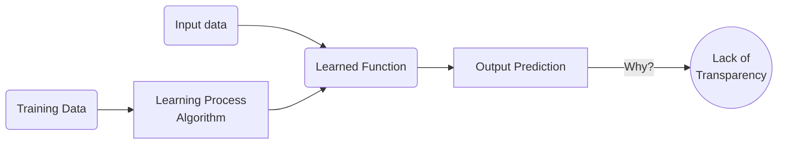
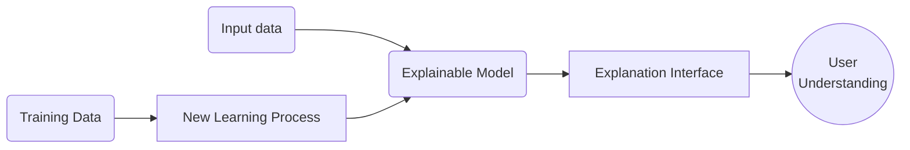

---
hide:
- navigation
- toc
---

# :material-chat-question: Why XAI?

!!! failure inline end "Traditional ML model"

    * Why did the model do that?
    * Why not something else?
    * When does the model succeed?
    * When does it fail?
    * When can we trust it?
    * How do we correct an error?

Artificial intelligence (AI) is **rapidly permeating numerous aspects of our lives** and is evolving into a
**game-changer** in many areas, including healthcare, energy, marketing, finance, security,
transportation, robotics, and image/speech recognition. AI growth is fuelled by the rapid increase of
available computational power, the abundance of data for training and testing sophisticated AI
models, and the resurgence of Machine learning (ML) in the last decade.

A **major drawback** with artificial neural networks is that it is **very difficult to explain their responses**
because their knowledge is embedded within the values of the parameters and neuron activations,
which are at first glance incomprehensible. The **transparency of AI models** is an important research
topic, as transparency is essential with respect to the European General Data Protection Regulation
(GDPR). In general, under the GDPR, every individual has the right to receive an explanation when
a decision has been made about them.

> Artificial intelligence (AI) is rapidly growing in various fields due to the availability
of computational power and data for training models. However, the lack of transparency in
AI models, particularly deep neural networks, is a major concern as it raises ethical and legal questions
limiting their societal acceptance.

**Explainable AI (XAI)** aims to address this issue by **explaining how a model produces its
results**.

***

The impressive
effectiveness of AI applications based on DL is often shadowed by their inability to explain their behaviours to human users.
Understanding how these algorithms operate, would allow **demystifying AI**, making such black-boxes
intelligible and explainable, and **improving everyone's confidence** in these tools. Explainable AI
encompasses AI methods aimed at explaining to a given audience, why or how a model produces
its results.

!!! success inline "Explainable AI model"

    * We can understand why
    * We can understand why not
    * We know when it will succeed
    * We know when it will fail
    * We know when to trust it
    * We know when it erred

XAI seeks to address this issue by developing AI models that can provide explanations that are clear, concise, and relevant to the user's context. By providing interpretable explanations for its decisions, XAI can help users better understand the reasoning behind AI models and build trust in their reliability and accuracy.

The **benefits of XAI** are many. For example, it can help to improve the accuracy and performance of
AI models by enabling users to identify and correct errors or biases in the data or the model itself.
XAI can also enhance the accountability and transparency of AI systems, which is essential for ensuring
ethical and fair use of AI in society.

> Explainability is a cornerstone for attaining some of the fundamental principles of **responsible AI**:
*fairness*, *transparency*, *privacy*, *accountability*, *safety*, *security*, and *reliability*.

However, there is currently no general-purpose software technology supporting symbolic
knowledge extraction from predictive models. This **lack of a homogeneous platform for open
science** in which explainability algorithms can be collected and executed is a challenge for
both research and teaching purposes.